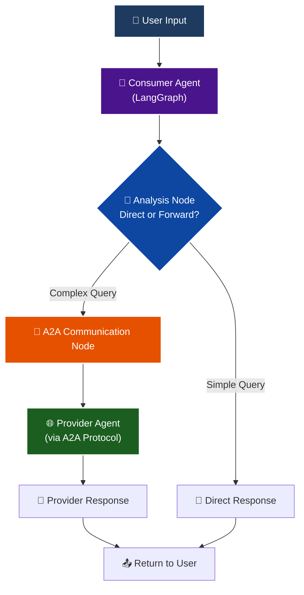

# Consumer Agent - A2A Protocol Client

This directory contains a **Consumer Agent** implementation that demonstrates how to build a LangGraph agent that communicates with the provider agent (in the `app/` directory) through the **A2A (Agent-to-Agent) Protocol**.

## 🎯 Overview

The Consumer Agent is a simple LangGraph-based agent that:
- Can handle basic queries directly
- Forwards complex queries to the provider agent via A2A protocol
- Maintains conversation memory
- Demonstrates intelligent routing between local and remote capabilities

## 🏗️ Architecture



## 📁 Files

- **`consumer_agent.py`** - Main consumer agent implementation with LangGraph
- **`cli.py`** - Interactive command-line interface
- **`test_consumer.py`** - Test script with various query types
- **`README.md`** - This documentation

## 🚀 Quick Start

### Prerequisites

1. **Provider Agent Running**: Make sure the provider agent is running first:
   ```bash
   # From the project root
   uv run python -m app
   ```

2. **Environment Variables**: Ensure you have the required environment variables:
   ```bash
   export OPENAI_API_KEY="your-openai-api-key"
   ```

### Running the Consumer Agent

#### Option 1: Interactive CLI
```bash
cd consumer
python cli.py
```

This provides an interactive chat interface where you can:
- Ask simple questions (handled directly)
- Ask complex questions (forwarded to provider)
- See the agent's decision-making process

#### Option 2: Run Tests
```bash
cd consumer
python test_consumer.py
```

This runs automated tests with various query types:
- Simple greetings and math
- Web search queries
- Academic paper searches
- Document retrieval requests

## 🤖 How It Works

### 1. Intelligent Routing
The consumer agent analyzes each user query to decide:
- **Direct Response**: For simple queries like greetings, basic math
- **Forward to Provider**: For complex queries requiring web search, academic papers, or document retrieval

### 2. A2A Communication
When forwarding to the provider:
1. Establishes connection to provider agent
2. Fetches provider's capabilities (AgentCard)
3. Sends user query via A2A protocol
4. Receives and returns provider's response

### 3. Conversation Memory
- Maintains conversation state using LangGraph's MemorySaver
- Supports multi-turn conversations
- Each thread maintains its own context

## 🔧 Consumer Agent Capabilities

### Local Capabilities (Direct)
- Basic greetings and conversational responses
- Simple mathematical calculations
- General knowledge questions

### Remote Capabilities (via Provider)
- **Web Search**: Current information from the internet
- **Academic Search**: Research papers from arXiv
- **Document Retrieval**: Information from loaded documents

## 📊 Example Interactions

### Simple Query (Direct Response)
```
You: Hello, how are you?
Agent: Hello! I'm doing well, thank you for asking. I'm here to help you with any questions or tasks you might have.
```

### Complex Query (Forwarded to Provider)
```
You: What are the latest developments in artificial intelligence?
Agent: I'll help you with that. Let me consult the provider agent...
[Connects to provider via A2A protocol]
Agent: [Detailed response with current AI developments from web search]
```

## 🛠️ Configuration

### Provider URL
By default, the consumer connects to `http://localhost:10000`. You can change this by modifying the `provider_base_url` parameter:

```python
consumer = ConsumerAgent(provider_base_url="http://your-provider:port")
```

### LLM Configuration
The consumer uses the same environment variables as the provider:
- `OPENAI_API_KEY`: Your OpenAI API key
- `TOOL_LLM_NAME`: Model name (default: `gpt-4o-mini`)
- `TOOL_LLM_URL`: API base URL (default: OpenAI)

## 🧪 Testing Different Scenarios

The test script includes various scenarios:

1. **Simple Queries**: Handled locally without A2A calls
2. **Web Search Queries**: Forwarded to provider for current information
3. **Academic Queries**: Uses provider's arXiv search capabilities
4. **Document Queries**: Uses provider's RAG system
5. **Multi-turn Conversations**: Tests conversation memory

## 🔍 Debugging

### Connection Issues
If you see connection errors:
1. Ensure the provider agent is running on `http://localhost:10000`
2. Check that both agents have the same environment variables
3. Verify network connectivity

### A2A Protocol Issues
The consumer logs detailed information about:
- Agent card fetching
- Message sending/receiving
- Error handling

Enable debug logging to see more details:
```python
logging.basicConfig(level=logging.DEBUG)
```

## 🚀 Next Steps

### Enhancements You Could Add:
1. **Multiple Providers**: Connect to multiple provider agents
2. **Caching**: Cache provider responses for efficiency
3. **Load Balancing**: Distribute queries across multiple providers
4. **Custom Skills**: Add consumer-specific capabilities
5. **UI Interface**: Build a web interface instead of CLI

### Advanced A2A Features:
1. **Streaming Responses**: Use streaming A2A messages
2. **Push Notifications**: Handle async provider notifications  
3. **Authentication**: Implement proper A2A authentication
4. **Error Recovery**: Robust error handling and retry logic

## 📚 Learning Objectives Achieved

Through this implementation, you've learned:
- How to build a LangGraph consumer agent
- A2A protocol client implementation
- Intelligent query routing and decision making
- Remote agent communication patterns
- Conversation state management

